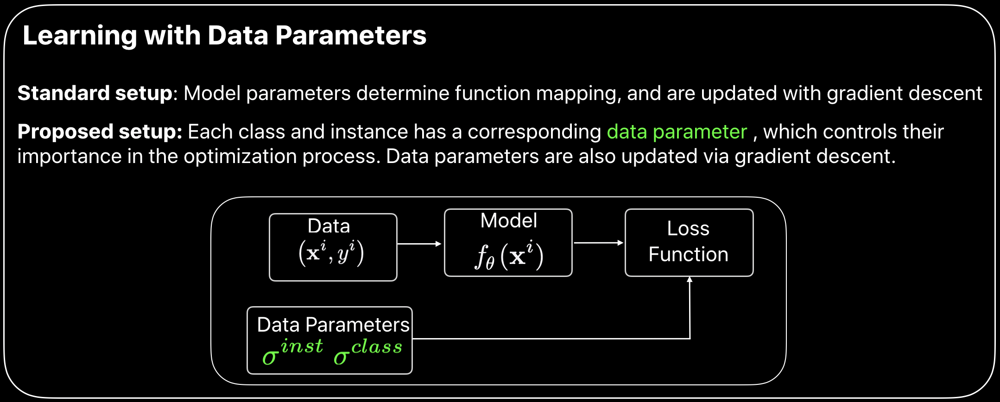
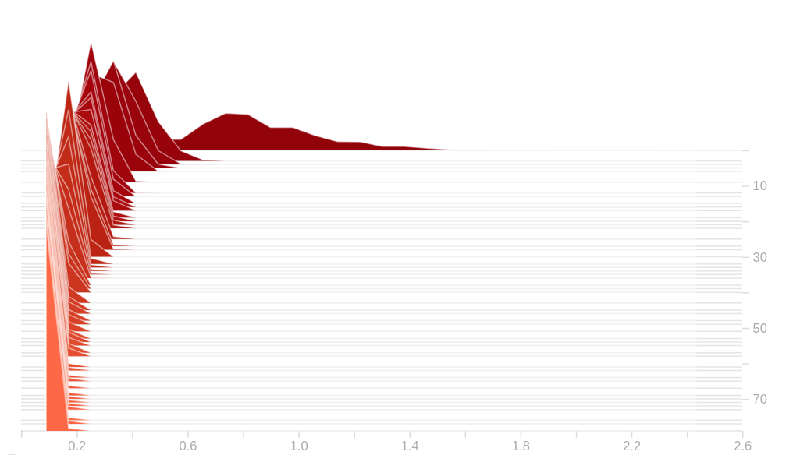

# Data Parameters: A New Family of Parameters for Learning a Differentiable Curriculum
This repository accompanies the research paper, 
[Data Parameters: A New Family of Parameters for Learning a Differentiable Curriculum](
https://papers.nips.cc/paper/9289-data-parameters-a-new-family-of-parameters-for-learning-a-differentiable-curriculum)
(accepted at NeurIPS 2019). The online copy of the poster is available 
[here](./media/data_parametres_neurips19_poster.pdf).

## Citation
If you find this code useful in your research then please cite:
```
@article{saxena2019data,
  title={Data Parameters: A New Family of Parameters for Learning a Differentiable Curriculum},
  author={Saxena, Shreyas and Tuzel, Oncel and DeCoste, Dennis},
  booktitle={NeurIPS},
  year={2019}
}
```
## Data Parameters
In the paper cited above, we have introduced a new family of parameters termed "data parameters".
Specifically, we equip each class and training data point with a learnable parameter (data parameters), which governs 
their importance during different stages of training. Along with the model parameters, the data parameters are also 
learnt with gradient descent, thereby yielding a curriculum which evolves during the course of training.
More importantly, post training, during inference, data parameters are not used, and hence do not alter the model's 
complexity or run-time at inference. 




## Setup and Requirements
This code was developed and tested on Nvidia V100 in the following environment.

- Ubuntu 18.04
- Python 3.6.9
- Torch 1.2.0
- Torchvision 0.4

## Getting Started
Apart from the system requirements, you would also need to download ImageNet dataset locally.
This path needs to be provided to main_imagenet.py with --data argument. 


### Training model with data parameters
With very little modification, an existing DNN training pipeline can be modified to use data parameters.
- The first modification is change in data loader. In contrast to standard data loaders which return (x_i, y_i) as 
a tuple. We need to return the index of the sample. This is a one line change in \__getitem\__ function (see 
[cifar_dataset.py](dataset/cifar_dataset.py) or [imagenet_dataset.py](dataset/imagenet_dataset.py)). Note, this 
change is required to implement instance level curriculum. Class level curriculum can be implemented without this 
modification.

- This brings us to the second change (crucial), change in optimizer. Standard optimizers in a deep learning framework like 
PyTorch are built for model parameters. They assume that at each iteration, all parameters are involved in the 
computational graph and receive a gradient. Therefore, at each iteration, all parameters undergo a weight decay 
penalty, along with an update to their corresponding momentum buffer. These assumptions and updates are valid for model
parameters, but not for data parameters. At each iteration, only a subset of data parameters are part of the 
computational graph (corresponding to classes and instances in the minibatch). Using standard optimizers 
from PyTorch for data parameters will apply a weight decay penalty on all data parameters at each iteration, and 
will therefore nullify the learnt curriculum. To circumvent this issue, we apply weight decay explicitly on the 
subset of data parameters participating in the minibatch. Also, we have implemented a SparseSGD optimizer which performs 
a sparse update of momentum buffer, updating buffer only for data parameters present in the computational graph.
More information can be found in file [sparse_sgd.py](optimizer/sparse_sgd.py).

- Apart from these changes, the only change required is instantiation of data parameters and rescaling of logits with data
parameters in the forward pass. Since data parameters interact with model at the last layer, in practice, there is 
negligible overhead in training time. 

- The three things which can be tuned for data parameters is their: initialization, learning rate, and weight decay. 
In practice, we have set initialization of data parameters to 1.0 (initializes training to use standard softmax loss).
This leaves us with two hyper-parameters whose value can be set by grid-search. In our experiments, we found data 
parameters to be robust to variations in these hyper-parameters. 

Below we provide example commands along with the hyper-parameters to reproduce results on ImageNet and
CIFAR100 noisy dataset from the paper. 

### ImageNet 
#### Baseline 
```
python main_imagenet.py \
  --arch 'resnet18' \ 
  --gpu 0 \
  --data 'path/to/imagenet' \
```
This command will train ResNet18 architecture on ImageNet dataset without data parameters. 
This experiment can be used to obtain baseline performance without data parameters.
Running this script, you should obtain 70.2% accuracy on validation @ 100 epoch.


#### Train with class level parameters 
To train ResNet18 with class-level parameters you can use this command:
```
python main_imagenet.py \
  --arch 'resnet18' \ 
  --data 'path/to/imagenet' \
  --init_class_param 1.0 \
  --lr_class_param 0.1 \
  --wd_class_param 1e-4 \
  --learn_class_paramters \
```
Note, the learning rate, weight decay and initial value of class parameters can be specified 
using --lr_class_param, --wd_class_param and --init_class_param respectively. 
Running this script with the hyper-parameters specified above, you should obtain 70.5% accuracy on 
validation @ 100 epoch. You can run this script with different values of lr_class_param and wd_class_param 
to obtain more intuition about data parameters. 

To facilitate introspection, the training script dumps the histogram, mean, highest and the lowest value of 
data parameters in the tensorboard for visualization. For example, in the figure below, we can visualize the histogram
of class-level parameters (x-axis) over the course of training (y-axis). The parameters of each class vary in the start 
of training, but towards the end of training, they all converge to similar value (indicating all classes were given 
close to equal importance at convergence).


#### Joint training with class and instance level parameters
As mentioned in the paper, it is possible to train with class and instance level parameters in a joint manner. 
To train ResNet18 with both parameters you can use this command:
```
python main_imagenet.py \
  --arch 'resnet18' \ 
  --data 'path/to/imagenet' \
  --init_class_param 1.0 \
  --lr_class_param 0.1 \
  --wd_class_param 1e-4 \
  --init_inst_param 0.001 \
  --lr_inst_param 0.8 \
  --wd_inst_param 1e-8 \
  --learn_class_paramters \
  --learn_inst_parameters 
```
For joint training setup, class and instance level parameters are initialized to 1.0 and 0.001. This is to ensure that 
their initial sum is close to 1.0. We did not experiment with other initialization schemes, but data parameters can
be initialized with any arbitrary value (greater than 0). Running this script with the hyper-parameters specified 
above, you should obtain 70.8% accuracy on validation @ 100 epoch.


#### CIFAR100 Noisy Data
[cifar_dataset.py](dataset/cifar_dataset.py) extends the standard CIFAR100 dataset from torchvision to allow corruption
of a subset of data with uniform label swap.

#### Baseline 
```
python main_cifar.py \
  --rand_fraction 0.4 \
```
This command trains WideResNet28_10 architecture on CIFAR100 dataset (corruption rate=40%) without data parameters. 
This experiment can be used to obtain baseline performance without data parameters.
Running this script, you should obtain 50.0% accuracy at convergence (see Table 2 in paper).

#### Train with instance level parameters
Since the noise present in the dataset is at instance level, we can train the DNN model with instance level parameters
to learn instance specific curriculum. The curriculum should learn to ignore learning from corrupt samples in the 
dataset.
```
python main_cifar.py \
  --rand_fraction 0.4 \
  --init_inst_param 1.0 \
  --lr_inst_param 0.2 \
  --wd_inst_param 0.0 \
  --learn_inst_parameters 
```
Running this script, using instance level parameters, you should obtain 71% accuracy @ 84th epoch. 
For results on noisy datasets, we always perform early stopping at 84th epoch (set by cross-validation).
Running with the same hyper-parameters for instance parameters, for 20% and 80% corruption rate, you should obtain 75%
 and 35% accuracy respectively. 


## License
This code is released under the [LICENSE](LICENSE) terms.
